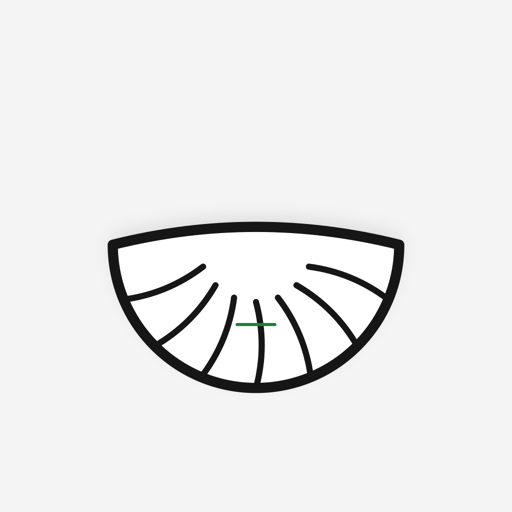
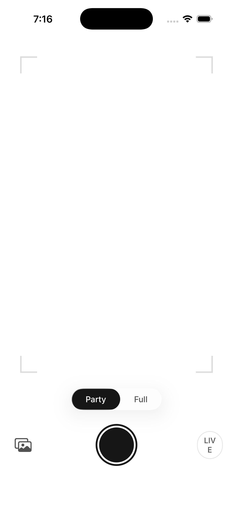

<p align="center">
  
</p>

<h1 align="center">Dumpling Not Dumpling</h1>

<p align="center">
  <em>Point. Tap. Dumpling?</em>
  <br />
  <strong>On-device ML classifier for iOS.</strong> Inspired by Jian-Yang's masterpiece from Silicon Valley.
</p>

<p align="center">
  
  
  
  
</p>

---

<p align="center">
  
</p>

## What is this?


You know the scene. Jian-Yang built an app that tells you if something is a hot dog. Or not a hot dog. Revolutionary.

This is that, but for **dumplings**.

Point your camera at something. Tap. The app tells you:

```
dumpling.        confidence: 0.97
```

or

```
not dumpling.    confidence: 0.99
```

That's it. That's the app.

## Features

**Party Mode** — Binary. Dumpling or not dumpling. The way Jian-Yang intended.

**Full Mode** — Actually identifies the *type*: gyoza, xiaolongbao, pierogi, momo, empanada, ravioli, wonton, samosa. For the dumpling connoisseur.

**Live Mode** — Continuous classification at ~5fps. Walk through a dim sum restaurant. Know everything.

**Fully Offline** — CoreML on-device inference. No cloud. No API keys. No data leaves your phone. Your dumpling habits are your own.

## Design

- **IBM Carbon** design tokens — 8px grid, 48px min tap targets
- **Inter** + **IBM Plex Mono** typography
- **Liquid Glass** effects on iOS 26+ (graceful fallback on 18+)
- Clean lines. No clutter. Just dumplings.

## Build

```bash
# Prerequisites: Xcode 16+, xcodegen
brew install xcodegen

# Generate & build
git clone https://github.com/stussysenik/dumpling-not-dumpling.git
cd dumpling-not-dumpling
xcodegen generate
open DumplingNotDumpling.xcodeproj
```

Hit `Cmd+R`. Point at a dumpling.

> **Note:** The current model is a development stub (random predictions). A real trained model is coming. The architecture is ready — just swap the `.mlmodel`.

## Architecture

```
DumplingNotDumpling/
├── App/                    # Entry point + main ContentView
├── Services/
│   ├── CameraService       # @Observable AVCaptureSession wrapper
│   └── ClassificationService  # CoreML + Vision pipeline
├── Views/
│   ├── CameraView          # Live viewfinder + corner brackets
│   ├── ResultView          # Party mode result
│   ├── FullModeResultView  # Type identification result
│   └── Components/         # GlassButton, ModeToggle, ConfidenceLabel
├── Models/
│   ├── ClassificationResult  # Data model + AppMode enum
│   └── DumplingClassifier.mlmodel
└── Resources/              # Inter, IBM Plex Mono, Assets
```

**Stack:** SwiftUI · CoreML · Vision · AVFoundation · `@Observable` · Swift 6 concurrency

## Testing

```bash
# Unit tests (16 tests)
xcodebuild test -scheme DumplingNotDumpling \
  -destination 'platform=iOS Simulator,name=iPhone 17'

# Maestro E2E (4 flows)
maestro test .maestro/
```

## Inspiration

> *"Jian-Yang, that app is not a hot dog app. It's a 'not hot dog' app."*
> — Erlich Bachman, Silicon Valley S4E4

---

<p align="center">
  <sub>Built with SwiftUI. Powered by dumplings.</sub>
</p>
